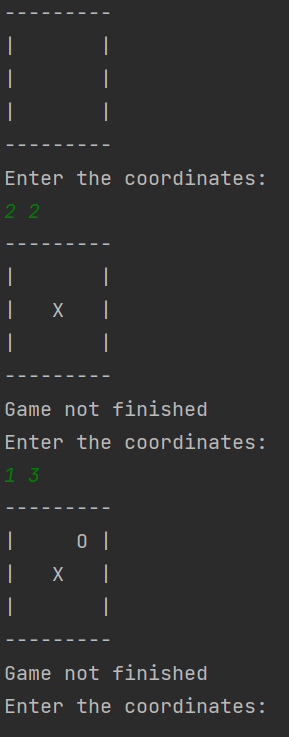

# Tic-Tac-Toe
This is a simple Tic-Tac-Toe game.

It requires two players to play.

Each player needs to enter a two-dimensional coordinate.

The first number is the row and the second number is the column.

